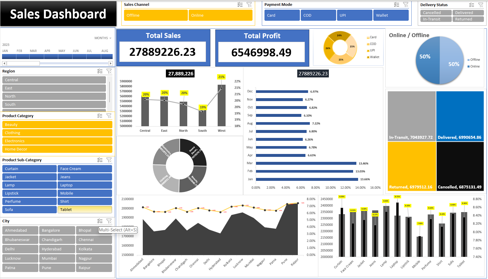

📊 Sales Dashboard (Excel)

📌 Overview

This project contains an interactive **Sales Dashboard** built in **Microsoft Excel**.
It provides a comprehensive view of sales, profit, and delivery performance across regions, categories, and time periods.

The dashboard is designed for **data analysis and business decision-making**, with user-friendly filters and visualizations.

---

## 🚀 Features

* **KPIs**

  * Total Sales
  * Total Profit

* **Filters / Slicers**

  * Year & Month
  * Region
  * Product Category & Sub-Category
  * City
  * Sales Channel (Online / Offline)
  * Payment Mode (Card, COD, UPI, Wallet)
  * Delivery Status (Delivered, Cancelled, In-Transit, Returned)

* **Visuals**

  * Sales vs. Profit by Region
  * Payment Mode Distribution
  * Online vs Offline Sales Split
  * Monthly Sales Trend (%)
  * Delivery Status Breakdown
  * City-Wise Sales Performance
  * Product Sub-Category Sales & Profit %

---

## 📂 Files

* `Sales_Dashboard.xlsx` → Main Excel dashboard file
* `Screenshot.png` → Preview of the dashboard

---

## 🛠 Tools & Skills Used

* **Microsoft Excel**

  * Pivot Tables
  * Pivot Charts
  * Slicers & Timelines
  * Conditional Formatting
  * Data Visualization

---

## 📸 Dashboard Preview

---

## 🔧 How to Use

1. Download the `Sales_Dashboard.xlsx` file.
2. Open in Microsoft Excel (2016 or later recommended).
3. Use the slicers (filters) to interact with the dashboard.
4. Analyze sales trends, profit margins, and delivery performance.

---

## 💡 Insights You Can Gain

* Compare **online vs offline sales** performance.
* Identify **top-performing regions and cities**.
* Track **monthly sales growth**.
* Analyze **product sub-category contributions**.
* Evaluate **delivery and return trends**.

---

## 📌 Future Enhancements

* Add **dynamic forecasting** for sales trends.
* Automate data refresh using **Power Query**.
* Connect with **Power BI** for advanced analytics.

---

## 👨‍💻 Author

**Raunak Patel**
📌 Computer Science Engineering Student
📊 Exploring Data Analytics & Visualization
